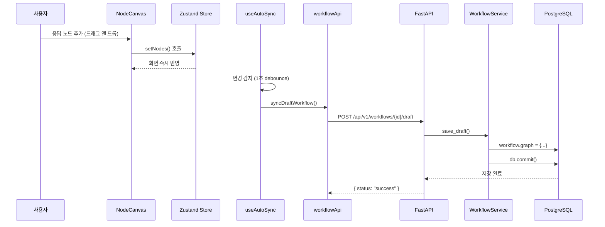

# 응답 노드(Answer Node) 데이터 흐름

사용자가 프론트엔드(React Flow)에서 **응답 노드(Answer Node)**를 생성하거나 수정했을 때,  
해당 변경사항이 백엔드(FastAPI)를 거쳐 데이터베이스(PostgreSQL)에 영구 저장되기까지의 기술적 흐름을 정리한 문서입니다.

---

## 개요 다이어그램



---

## 1. Frontend: 응답 노드 생성 및 상태 관리

사용자의 인터랙션이 발생하면 가장 먼저 클라이언트 측 상태(Store)가 업데이트됩니다.

### 관련 파일

- `apps/client/app/features/workflow/config/nodeRegistry.ts`  
    노드 타입 정의
    
- `apps/client/app/features/workflow/components/nodes/answer/components/AnswerNode.tsx`  
    노드 컴포넌트
    
- `apps/client/app/features/workflow/store/useWorkflowStore.ts`  
    상태 관리
    

---

### Answer Node 데이터 구조

```ts
// AnswerNode.tsx
interface AnswerNodeOutput {
  variable: string; // 출력 변수명 (예: "result")
  value_selector: string[]; // [node_id, key] 형태로 데이터 소스 지정
}

interface AnswerNodeData extends BaseNodeData {
  outputs: AnswerNodeOutput[];
}
```

---

### 주요 동작

- 사용자가 좌측 사이드바에서 **"응답" 노드**를 캔버스로 드래그합니다.
    
- `nodeRegistry.ts`에 정의된 기본값으로 노드가 생성됩니다.
    

```ts
// nodeRegistry.ts
{
  type: 'answerNode',
  category: 'output',
  label: '응답',
  icon: <MessageSquare className="h-4 w-4" />,
  defaultData: {
    title: '응답',
    outputs: [],
  },
}
```

- `setNodes` 액션이 트리거되어 Zustand Store의 `nodes` 배열에 새 노드가 추가됩니다.
    

```ts
// useWorkflowStore.ts
setNodes: (nodes) => {
  const { workflows, activeWorkflowId } = get();
  const updatedWorkflows = workflows.map((w) =>
    w.id === activeWorkflowId ? { ...w, nodes } : w,
  );
  set({ nodes, workflows: updatedWorkflows });
},
```

---

## 2. Frontend: 응답 노드 설정 (패널 UI)

노드를 선택하면 우측 패널에서 상세 설정이 가능합니다.

### 관련 파일

- `apps/client/app/features/workflow/components/nodes/answer/components/AnswerNodePanel.tsx`
    

---

### 주요 동작

- 사용자가 캔버스에서 응답 노드를 클릭합니다.
    
- `AnswerNodePanel` 컴포넌트가 렌더링됩니다.
    
- 사용자가 출력 변수를 추가/수정합니다.
    
    - 출력 키 입력 (예: `result`)
        
    - 소스 노드 선택 (예: 시작)
        
    - 변수 키 선택/입력
        

```ts
// AnswerNodePanel.tsx
const handleUpdateOutput = useCallback(
  (index: number, field: keyof AnswerNodeOutput, value: string | string[]) => {
    const newOutputs = [...(data.outputs || [])];
    newOutputs[index] = { ...newOutputs[index], [field]: value };
    updateNodeData(nodeId, { outputs: newOutputs }); // Store 업데이트
  },
  [data.outputs, nodeId, updateNodeData]
);
```

- `updateNodeData`가 호출되어 Store의 해당 노드 데이터가 변경됩니다.
    

```ts
// useWorkflowStore.ts
updateNodeData: (nodeId, newData) => {
  set({
    nodes: get().nodes.map((node) => {
      if (node.id === nodeId) {
        return {
          ...node,
          data: { ...node.data, ...newData },
        };
      }
      return node;
    }),
  });
},
```

---

## 3. Frontend: 자동 동기화 (Auto Sync)

사용자 경험을 해치지 않으면서 데이터를 저장하기 위해 자동 동기화 로직이 백그라운드에서 동작합니다.

### 관련 파일

- `apps/client/app/features/workflow/hooks/useAutoSync.ts`
    

---

### 주요 동작

- `useEffect`가 `nodes`, `edges` 등 주요 데이터의 변경을 감지합니다.
    
- Debounce 패턴을 적용하여 마지막 변경 후 **1초 대기**합니다.
    
- 대기 시간이 지나면 `workflowApi.syncDraftWorkflow`를 호출합니다.
    

```ts
// useAutoSync.ts
const debouncedSync = useMemo(
  () =>
    debounce(
      async (currentNodes, currentEdges, currentFeatures, ...) => {
        await workflowApi.syncDraftWorkflow(workflowId, {
          nodes: currentNodes,
          edges: currentEdges,
          viewport: { x: 0, y: 0, zoom: 1 },
          features: currentFeatures,
          environmentVariables: currentEnvVars,
          conversationVariables: currentConvVars,
        });
      },
      1000,
      { maxWait: 300000 },
    ),
  [workflowId],
);
```

> **NOTE**  
> 초기 로딩이 완료되기 전에는 저장이 수행되지 않습니다.  
> 이는 빈 데이터로 기존 워크플로우를 덮어쓰는 것을 방지합니다.

---

## 4. API 요청 (HTTP Layer)

### 관련 파일

- `apps/client/app/features/workflow/api/workflowApi.ts`
    

```ts
// workflowApi.ts
syncDraftWorkflow: async (workflowId: string, data: WorkflowDraftRequest) => {
  const response = await axios.post(
    `${API_BASE_URL}/workflows/${workflowId}/draft`,
    data,
  );
  return response.data;
},
```

### HTTP 요청 정보

|항목|내용|
|---|---|
|Method|POST|
|Endpoint|/api/v1/workflows/{workflowId}/draft|
|Content-Type|application/json|

---

### Payload 구조 (응답 노드 포함 예시)

```json
{
  "nodes": [
    {
      "id": "start-1",
      "type": "startNode",
      "position": { "x": 250, "y": 250 },
      "data": { "title": "시작", "triggerType": "manual", "variables": [] }
    },
    {
      "id": "answer-abc123",
      "type": "answerNode",
      "position": { "x": 500, "y": 250 },
      "data": {
        "title": "응답",
        "outputs": [
          {
            "variable": "result",
            "value_selector": ["start-1", "user_input"]
          }
        ]
      }
    }
  ],
  "edges": [],
  "viewport": { "x": 0, "y": 0, "zoom": 1 }
}
```

---

## 5. Backend: 요청 수신 및 검증 (API Layer)

### 관련 파일

- `apps/server/api/v1/endpoints/workflow.py`
    
- `apps/server/schemas/workflow.py`
    

```py
@router.post("/{workflow_id}/draft")
def sync_draft_workflow(
    workflow_id: str,
    request: WorkflowDraftRequest,
    db: Session = Depends(get_db)
):
    """
    프론트엔드로부터 워크플로우 초안 데이터를 받아 PostgreSQL에 저장합니다.
    """
    return WorkflowService.save_draft(db, workflow_id, request)
```

---

## 6. Backend: 데이터 처리 (Service Layer)

### 관련 파일

- `apps/server/services/workflow_service.py`
    

```py
class WorkflowService:
    @staticmethod
    def save_draft(db: Session, workflow_id: str, request: WorkflowDraftRequest):
        workflow = db.query(Workflow).filter(Workflow.id == workflow_id).first()

        if not workflow:
            workflow = Workflow(
                id=workflow_id,
                tenant_id="default-tenant",
                app_id="default-app",
                created_by=user_id,
            )
            db.add(workflow)

        workflow.graph = {
            "nodes": [node.model_dump() for node in request.nodes],
            "edges": [edge.model_dump() for edge in request.edges],
            "viewport": request.viewport.model_dump() if request.viewport else None,
        }

        db.commit()
        db.refresh(workflow)

        return {
            "status": "success",
            "message": "Draft saved to PostgreSQL",
            "workflow_id": workflow_id,
        }
```

---

## 7. Database: 영구 저장 (Persistence Layer)

### 데이터베이스

- PostgreSQL
    

### Workflow 모델

```py
class Workflow(Base):
    __tablename__ = "workflows"

    id = mapped_column(String, primary_key=True)
    tenant_id = mapped_column(String, nullable=False)
    app_id = mapped_column(String, nullable=False)

    graph = mapped_column(JSONB, nullable=True)

    created_by = mapped_column(String, nullable=False)
    created_at = mapped_column(DateTime, default=datetime.utcnow)
    updated_at = mapped_column(DateTime)
```

---

## 전체 흐름 요약

```
[사용자 액션]
  ↓
노드 생성/수정 → Zustand Store 업데이트 → 화면 반영
  ↓ (1초 debounce)
자동 동기화 감지 → API 호출
  ↓
요청 수신 및 검증 → 서비스 로직 처리
  ↓
PostgreSQL workflows.graph(JSONB) 저장
```

---

## 관련 파일 목록

| 레이어           | 파일 경로                                                                                    |
| ------------- | ---------------------------------------------------------------------------------------- |
| Node 컴포넌트     | apps/client/app/features/workflow/components/nodes/answer/components/AnswerNode.tsx      |
| Node 패널       | apps/client/app/features/workflow/components/nodes/answer/components/AnswerNodePanel.tsx |
| 상태 관리         | apps/client/app/features/workflow/store/useWorkflowStore.ts                              |
| 자동 동기화        | apps/client/app/features/workflow/hooks/useAutoSync.ts                                   |
| API 클라이언트     | apps/client/app/features/workflow/api/workflowApi.ts                                     |
| Backend 엔드포인트 | apps/server/api/v1/endpoints/workflow.py                                                 |
| 서비스 로직        | apps/server/services/workflow_service.py                                                 |
| DB 모델         | apps/server/db/models/workflow.py                                                        |