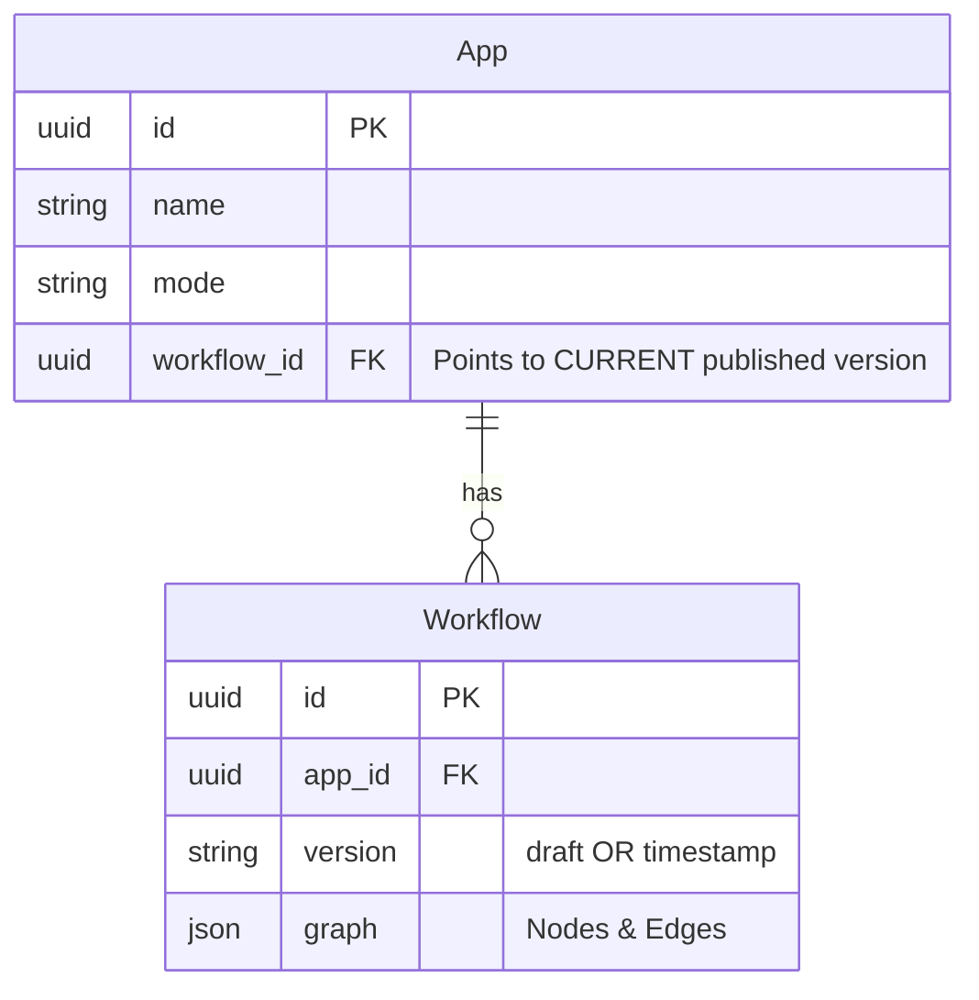

Dify에서 `App` 테이블과 `Workflow` 테이블이 분리되어 있는 이유는 **어플리케이션의 "껍데기(메타데이터/설정)"와 "알맹이(실행 로직/버전)"를 분리하여 유연하게 관리하기 위함**입니다.

이 문서는 코드 레벨(`WorkflowService` 등)에서의 분석을 바탕으로 이 구조가 어떻게 동작하는지 상세히 설명합니다.

## 1. 역할의 분리 (Separation of Concerns)

### App (`api/models/model.py`)

- **역할**: 어플리케이션의 **고유한 정체성(Identity)**과 **외부 인터페이스**를 관리합니다.
- **주요 데이터**:
  - `id`, `name`, `icon`, `mode`: 앱의 기본 정보
  - `enable_api`, `api_rpm`: API 접근 제어 설정
  - `workflow_id`: **현재 배포(Publish)된** 워크플로우의 참조 ID
- **의미**: 사용자가 인식하는 "앱" 그 자체입니다. 내부 로직이 업데이트되어도 앱의 ID나 엔드포인트는 변하지 않습니다.

### Workflow (`api/models/workflow.py`)

- **역할**: 데이터가 흐르는 **실행 그래프(Execution Graph)**와 **버전(Version)**을 관리합니다.
- **주요 데이터**:
  - `app_id`: 소속된 App의 ID
  - `version`: `draft` 또는 타임스탬프 기반의 버전 번호
  - `graph`: 노드와 엣지로 구성된 JSON 실행 로직
  - `environment_variables`: 해당 버전에서 사용하는 환경 변수 정의
- **의미**: 특정 시점의 앱 실행 로직 스냅샷입니다.

---

## 2. 생명주기 및 동작 흐름 (Lifecycle & Logic Flow)

`WorkflowService`(`api/services/workflow_service.py`)의 코드를 보면 두 테이블이 어떻게 상호작용하는지 명확히 알 수 있습니다.

### 2.1. Draft (작업 중 상태)

- 사용자가 캔버스에서 워크플로우를 편집하면 `sync_draft_workflow` 메서드가 호출됩니다.
- 이때 `Workflow` 테이블에서 `version='draft'`인 레코드를 찾아 업데이트합니다. (없으면 생성)
- 즉, **Draft 버전은 앱당 오직 하나만 존재**하며 계속 덮어씌워집니다.

### 2.2. Publish (배포)

- 사용자가 "배포(Publish)" 버튼을 누르면 `publish_workflow` 메서드가 실행됩니다.
- **동작 방식**:
  1.  현재의 `draft` 워크플로우를 조회합니다.
  2.  이를 복제하여 **새로운 `Workflow` 레코드**를 생성합니다.
  3.  새 레코드의 `version`은 현재 시간 등을 기반으로 고유하게 생성됩니다.
  4.  마지막으로, **`App` 테이블의 `workflow_id` 필드를 새로 생성된 워크플로우 ID로 업데이트**합니다.
- 이로써 실제 서비스(`Run`)는 항상 `App.workflow_id`가 가리키는 버전을 참조하여 실행됩니다.

## 3. DB 스키마 관계도 (Conceptual ERD)

- **1:N 관계**: 하나의 App은 여러 개의 Workflow(이력)를 가집니다.
- **포인터 역할**: `App` 테이블의 `workflow_id`는 현재 활성화된 버전을 가리키는 포인터 역할을 합니다.

## 4. 확장성 (Extensibility)

이 구조는 다양한 앱 모드(`AppMode`)를 유연하게 지원합니다.

- **Chatflow / Workflow 앱**: 복잡한 그래프가 필요하므로 `Workflow` 테이블을 적극적으로 사용합니다.
- **기본 Chat / Completion 앱**: 초기에는 단순 설정(`AppModelConfig`)만 사용할 수도 있으며, 필요에 따라 고급 워크플로우로 확장할 때 구조 변경 없이 `Workflow`를 연결할 수 있습니다.

## 요약

- **App** = **Identity & Pointer** (변하지 않는 껍데기, 현재 버전을 가리킴)
- **Workflow** = **Logic & History** (버전별 실행 로직 저장소)

이 설계를 통해 Dify는 **안전한 라이브 배포**, **버전 롤백**, **편집 중인 내용의 격리(Draft)** 기능을 구현하고 있습니다.
